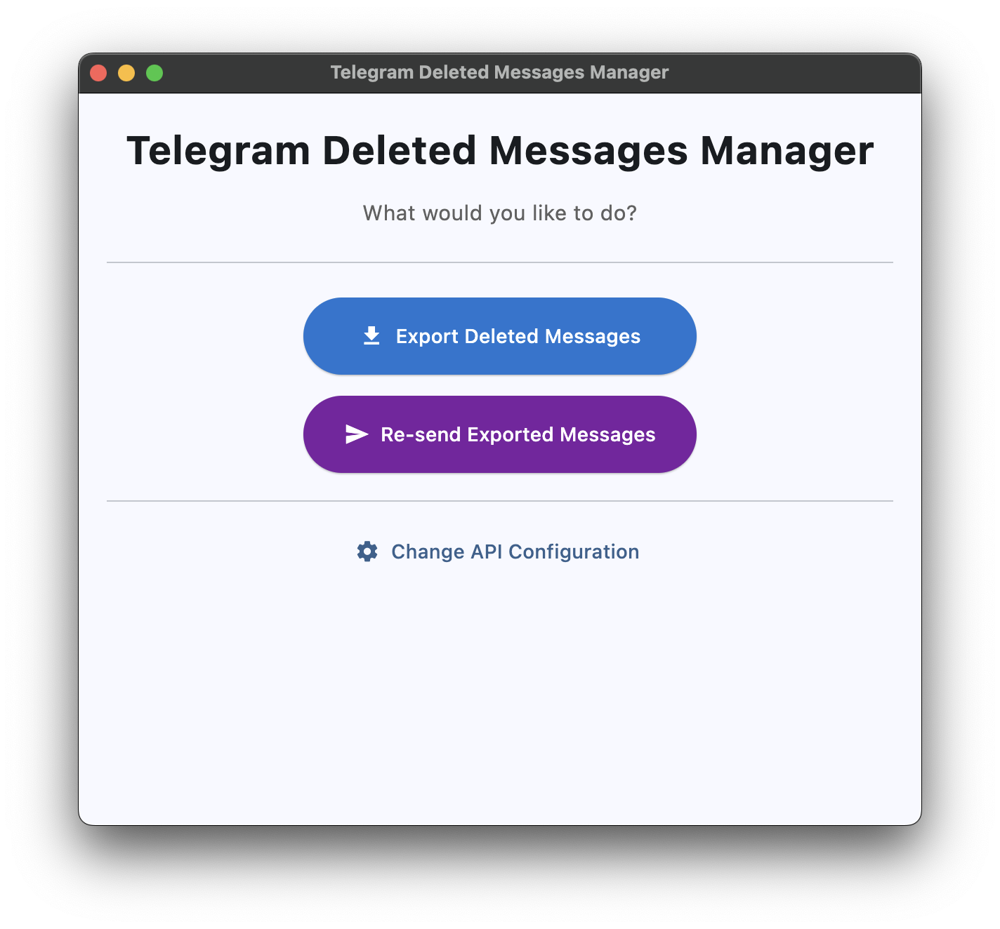
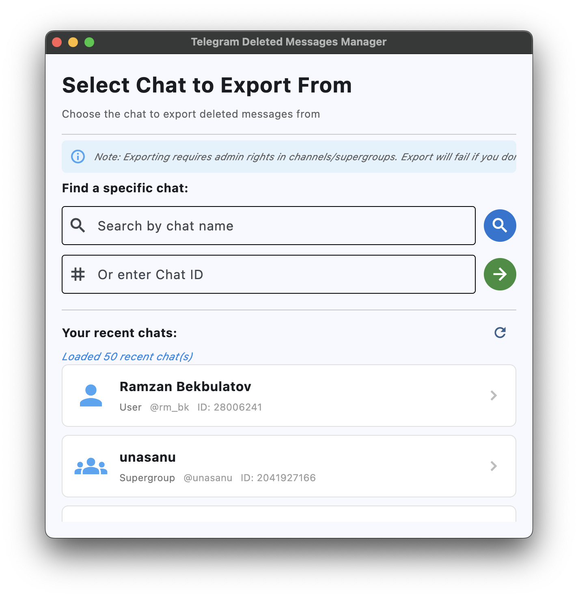
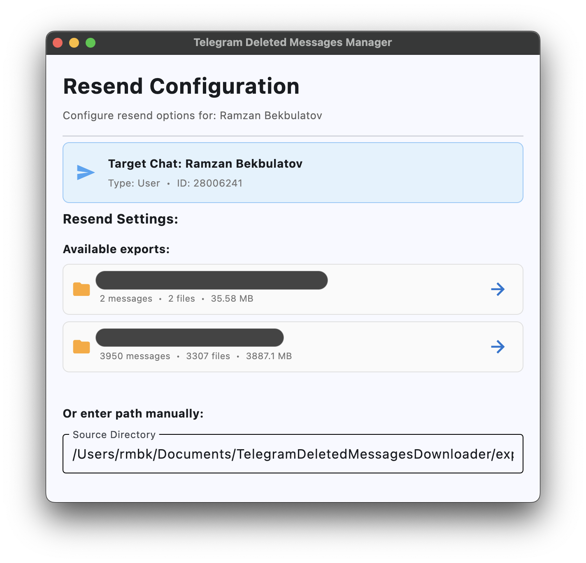
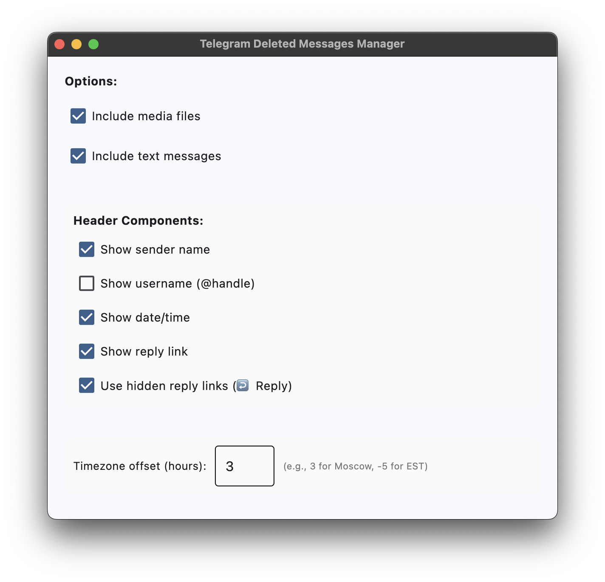
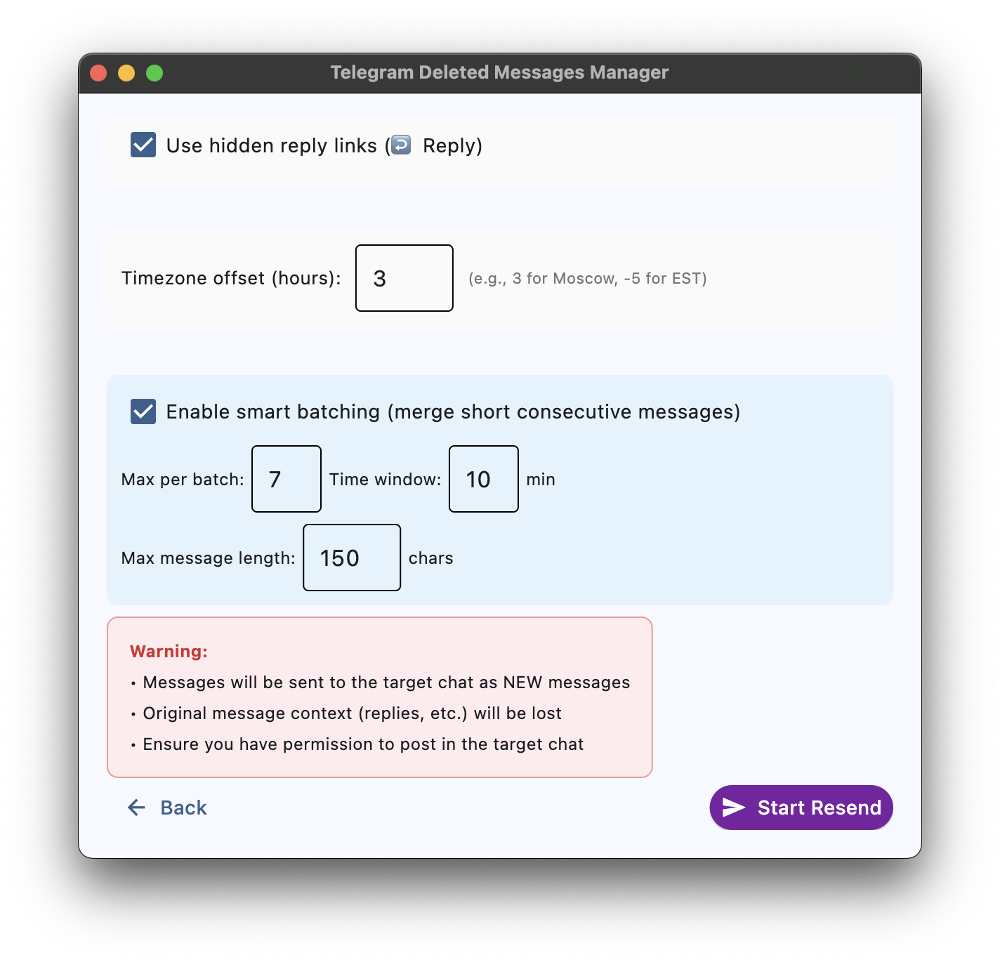

# Telegram Deleted Messages Manager

[](https://github.com/uburuntu/Telegram-Deleted-Messages-Manager/actions/workflows/ci.yml)
[](https://github.com/uburuntu/Telegram-Deleted-Messages-Manager/actions/workflows/cd.yml)
[](https://opensource.org/licenses/MIT)

Export and re-send deleted Telegram messages with a modern cross-platform GUI. 📥 Archive important messages before they disappear, then 📤 resend them anywhere you need!

## Screenshots

<div align="center">

### Main Menu


### 📥 Export Chat Selection


### 📤 Resend Configuration


### ⚙️ Resend Options


### Smart Batching


</div>

## Download

**[Latest Release](https://github.com/uburuntu/Telegram-Deleted-Messages-Manager/releases/latest)**

- Windows: `TelegramDeletedMessagesManager-windows.exe`
- macOS: `TelegramDeletedMessagesManager-macos` / `.app.zip`
- Linux: `TelegramDeletedMessagesManager-linux`

## Features

- 📥 **Export deleted messages** from Telegram chats (requires admin access)
- 📤 **Re-send messages** to any chat with customizable headers
- ⚙️ **Smart batching** - merge consecutive short messages automatically
- 🌍 **Timezone adjustment** - display messages in your local time
- 🔗 **Hidden reply links** - clean formatting with clickable references
- ⚡ **Parallel downloads** with automatic FloodWait handling
- 🖥️ **Cross-platform** - works on Windows, macOS, and Linux

## 🚀 Quick Start

### Pre-built Binary

1. Download for your platform
2. **macOS users**: See [macOS Security](#macos-security) below
3. Run the executable (macOS/Linux: `chmod +x TelegramDeletedMessagesManager-*`)
4. Enter [Telegram API credentials](https://my.telegram.org/auth) on first launch

#### macOS Security

macOS will block unsigned apps with "damaged" error. To bypass Gatekeeper:

```bash
# Remove quarantine attribute
xattr -cr TelegramDeletedMessagesManager-macos

# Then run normally
./TelegramDeletedMessagesManager-macos
```

**Alternative**: Right-click → Open → Click "Open" to allow once.

### From Source

```bash
git clone https://github.com/uburuntu/Telegram-Deleted-Messages-Manager.git
cd Telegram-Deleted-Messages-Manager
uv sync
uv run python main.py
```

## Development

```bash
make test          # Run tests
make lint          # Check code quality
make format        # Auto-format code
make build         # Build executable
```

## Configuration

Settings persist in `app_config.json`. Exports saved to `~/Documents/TelegramDeletedMessagesManager/` (or project root in dev mode).

## Requirements

- Python 3.14+ (for development)
- Telegram API credentials ([get here](https://my.telegram.org/auth))
- Admin access to source chat (for exports)

## Architecture

```
src/
├── models/      # Pydantic data models
├── services/    # Business logic
├── ui/          # Flet UI components
└── utils/       # Helpers

tests/           # Unit tests
```

## CI/CD

- **CI:** Auto-tests on push/PR (lint, format, test, build)
- **CD:** Auto-release on version tags (`v*.*.*`)
- **Local testing:** `brew install act && make test-ci`

See [Release Process](.github/RELEASE.md) for details.

## Contributing

1. Fork the repository
2. Create feature branch
3. Run tests: `make test && make lint`
4. Submit pull request

## License

MIT License - see [LICENSE](LICENSE) file.

## Resources

- [Flet Framework](https://flet.dev/)
- [Telethon Library](https://github.com/LonamiWebs/Telethon)
- [Issue Tracker](https://github.com/uburuntu/Telegram-Deleted-Messages-Manager/issues)
